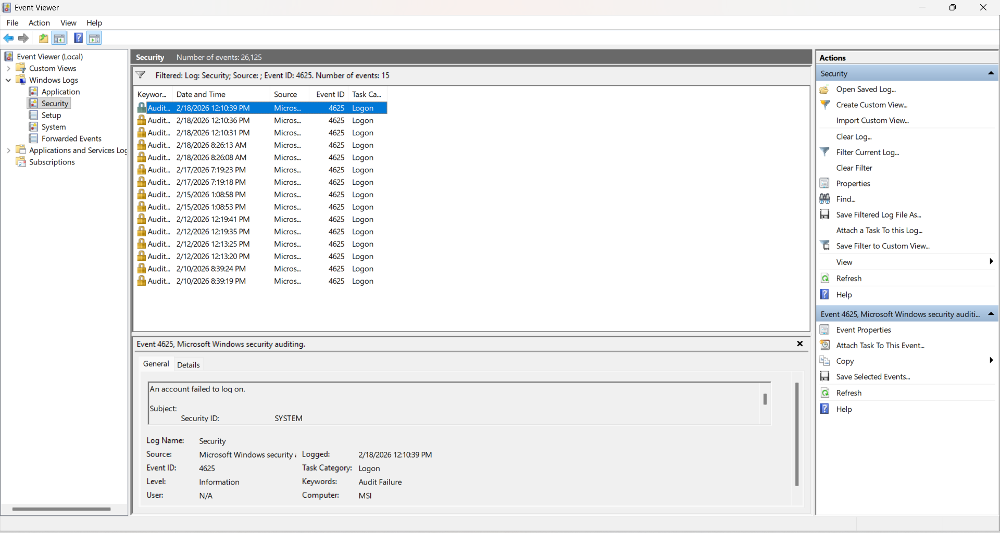

Log Analysis Example - Failed Login Investigation

## Scenario
A server is experiencing repeated failed login attempts. first prioity is to determine whether this is a brute-force attack or normal user error.

## Sample log Entry
Jan 12 10:15:32 server sshd[2145]: Failed password for invalid user admin from 203.0.113.45 port 51432 ssh2 

## Screenshot Evidence - Event ID 4625
The following screenshot shows multiple failed logon attempts recorded in the Windows Security Log (Event ID 4625).

Observations:
- Repeated attempts against the same account
- time clustering suggests potential brute-force activity

Analyst Note: Further investigation would include reviewing succesful logons (Event ID 4624) and account lockout events (Event ID 4740) to determine the scope of the suspicious activity.

## Key Fields Breakdown
- Timestamp: Jan 12 10:15:32
- Service: sshd
- Event: Failed password attempt
- Username: admin (invalid user)
- Source IP: 203.0.11.45
- Port: 51432

## Indicators of Suspicious Activity
- Attempted login to a common admin account
- Remote IP address
- Repeated failures suggest automation
- Indavild user indicates probing for existing accounts

## Analyst Assessment 
This activity is consistent with a brute-force or credentail-stuffing attempt against SSH.
Next steps would be to:
          - Block offending IP address
          - Check for additional attempts from other IPs
          - Verify no succesful logins occured 
          - Consider disabling password authentication in favor of SSH keys

## MITRE ATT&CK Mapping
- T1110 - Brute Force
